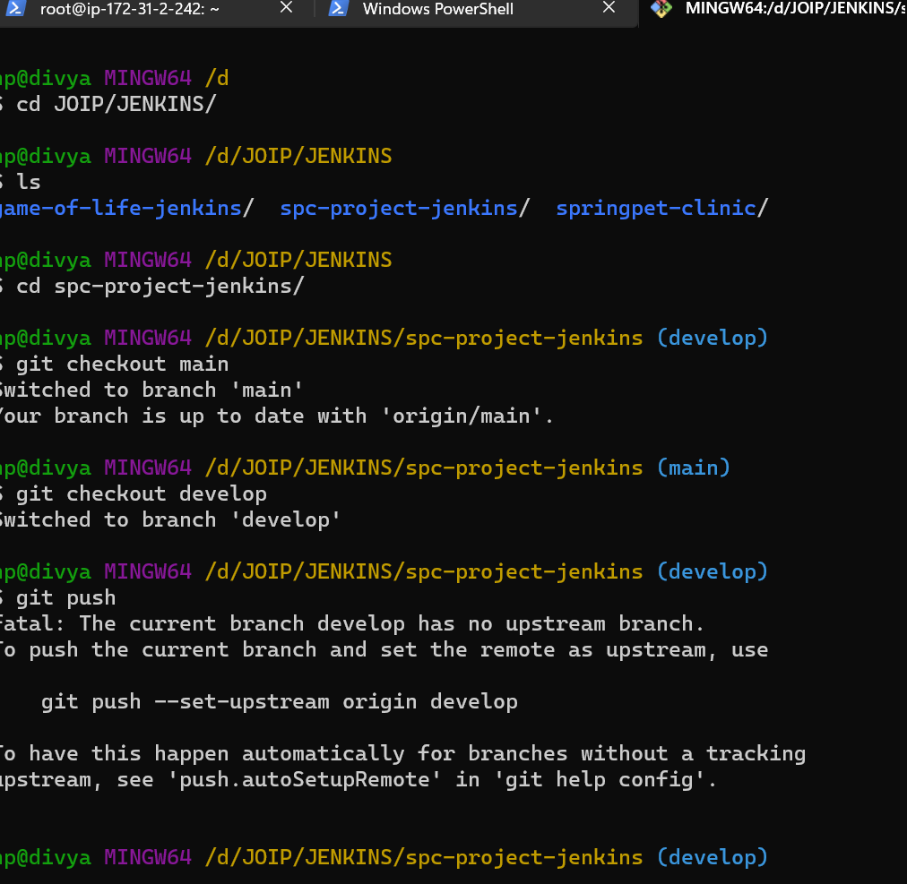

### SPRING PET CLINIC APPLICATION(spc) USING JENKINS
------------------------------------------------

### prerequisites for spc application are

  * java-17
  * maven (Maven is a tool which can be use to build, package, distribute, test and generate documentation for java and java based languages.The maven uses a file called as pom.xml)

Get the code from github. Refer here for the code.

`https://github.com/spring-projects/spring-petclinic`

Create a branch  `develop`




### Jenkins and node installations for spc application

* Create a two virtual machines.
  
* One Jenkins master and other node for spc.

* Node represents the machine on which build can be executed.
  
* On Jenkins node install java-17 and and configure jenkins on the machine.
  
* Refer here for Jenkins installation on ubuntu
https://www.jenkins.io/doc/book/installing/linux/ 

* When we install Jenkins we will have a user created called as Jenkins.


* From Jenkins we can perform anything which jenkins user can perform.

* To perform frequent integrations and deployments we need a tool which can help us doing the same stuff and integrate with multiple tools.
  
* These tools are generally called as `CI/CD Engines`.
 
* Jenkins is popular Opensource CI/CD Engine.

* Now in node we need to install java-17 and maven.

* Java-17 and maven-3.9.3 installation steps on node.

```
sudo apt update
sudo apt install openjdk-17-jdk -y

cd /tmp
wget https://dlcdn.apache.org/maven/maven-3/3.9.3/binaries/apache-maven-3.9.3-bin.tar.gz
sudo mkdir /usr/share/maven
sudo tar -xvzf apache-maven-3.9.3-bin.tar.gz -C /usr/share/maven
add /usr/share/maven/apache-maven-3.9.3/bin to the PATH variable /etc/environment for all (or)
add to ~/.bashrc for particular user and check 
mvn --version

```

* Here we are building an application called spring pet clinic.
where we use maven tool to generate artifacts. 

```

 pipeline {
    agent { label 'JDK_17'}
    options{
        timeout(time: 15, unit: 'MINUTES') 

    }
    triggers { pollSCM('* * * * *') }
    tools {
        jdk 'JDK_17'
    }
    stages {
        stage('vcs') {
            steps {
                git url: 'https://github.com/divyakothuru311/spc-project-jenkins.git',
                    branch: 'develop'
                
                            
            }
        }    
        stage('build and package') {
            steps {
                rtMavenDeployer (
                    id: "SPC_DEPLOYER",
                    serverId: "JFROG_INSTANCE",
                    releaseRepo: 'spc-libs-release',
                    snapshotRepo: 'spc-libs-snapshot'
                )
            }        
        }    
        
        stage('execute maven') {
             steps {
                rtMavenRun (
                    tool: 'DEFAULT',// Tool name from Jenkins configuration
                    pom:'pom.xml',
                    goals: 'clean install',
                    deployerId: "SPC_DEPLOYER"
                )
            } 
        }
        stage('Publish build info') {
            steps {
                rtPublishBuildInfo (
                    serverId: "JFROG_INSTANCE"
                )
            } 
        }
        stage('SonarQube analysis') {
            steps {
                withSonarQubeEnv('SONARCLOUD') {
                          sh 'mvn clean package sonar:sonar -Dsonar.organization=spring-application -Dsonar.token=a49b9d99ab452ad93290f7e7337eee4f23507d07 -Dsonar.projectKey=spring-application_sonar-spring'
                }
            }    
        }
           
   
        stage('report') {
            steps {
                junit testResults: '**/target/surefire-reports/TEST-*.xml'
             }
         }
    }
    post {
        success {
            mail subject: 'regarding build status',
                 body: 'your build is success',
                 to: 'spcproject@devops.com'
        }
        failure {
            mail subject: 'regarding build status',
                 body: 'your build is failure',
                 to: 'spcproject@devops.com'
        }

    }
}
    
 
```

### configuration of mail in jenkins

* we configured mail notifications(mailtrap) to jenkins so that we get notifications to mail when the build is success or failure.


* Here is a test msg that is sent by jenkins when configured.

* 

* when the build is success you will get the output as 


### jfrog repository

* And for artifact repository we use jfrog(artifact repository).

* As repository maintains history also. 

* Install the artifactory plugin in jenkins to deploy artifacts to jfrog.

* url for jfrog free trail:
 `https://jfrog.com/platform/free-trial/`

* Generate a token and configure the token in jenkins.

* 

* when the above pipeline is excuted the artifacts will be stored in jfrog as below

* 

* 
  
### static code analysis 

* We do static code analysis also code coverage for application using `sonarqube`.

* For this we need to install plugin called `Sonarqube scanner` in jenkins

* Also configure it by giving a credentials.

* 

* Results generated in sonarqube 
  

* 

* 

* 


  
  

* 


